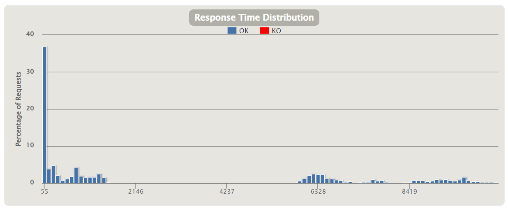

# aw10-final 响应式在线购物系统

## 1、子系统功能说明

### 1.1、在线购物系统

#### 1.1.1、pos-discovery

注册中心，项目中的多个微服务均需要在该注册中心进行注册，用于微服务之间的相互调用和进行负载均衡等。

#### 1.1.2、pos-gateway

网关服务，在该模块中，向外界提供了一个统一的访问入口，用来将外界的请求进行相应的转发；并在该模块中集成了外部的一个快递服务（delivery），使得外界不仅可以直接通过地址访问delivery，还可以通过访问网关然后将服务进行转发到delivery。

#### 1.1.3、pos-products

该模块包含了项目中所涉及到的商品的信息，可以通过调用相应的api来获得对应的商品信息。

```
/products
	get:	获取到所有的商品信息
/products/random 		
	get:	随机获取到一个商品
/products/{productId} 	
	get:	根据商品的id来获取到商品的信息
```

需要说明的是，上面列出来的api均省略了前缀 `/api`，访问时需要加上前缀进行访问，后面的模块列出的api同理。

#### 1.1.4、pos-carts

该模块提供用户的购物车相关的服务，用户可以通过用户名查看购物车，并可以向指定用户的购物车中添加商品、移除商品，以及清空购物车并进行支付。在本模块的实现中，一个用户初次对购物车进行操作时，会自动生成购物车然后完成用户的操作，即用户不需要主动创建购物车。

```
/carts/{username}
	get:		获取用户的购物车			
	post:		清空购物车，并支付购物车中的商品
	delete:		清空购物车，不支付商品
/carts/{username}/{productId}
	post:		向购物车中添加一个商品
	delete:		在购物车中删除一个商品
/carts/{username}/{productId}/incr
	put:		购物车中指定商品的数量+1
/carts/{username}/{productId}/decr
	put:		购物车中指定商品的数量-1
```

在方法执行过程中会需要访问商品的相关信息，这个信息是通过调用 `pos-products` 模块中提供的api来完成的。清空购物车并支付购物车中的商品，完成此过程需要创建一个订单，而创建订单的则是依赖于 `pos-order` 模块中提供的api来完成的。

#### 1.1.5、pos-order

本模块主要提供了订单服务，可以利用本模块来进行订单的创建和查询。

```
/order/{username}
	get:	获取用户的所有订单信息
/order/{username}/{orderId}
	get:	获取指定用户的指定订单
/order/{username}/{productId}/{quantity}
	post:	创建一份订单，其是指定数量的单类商品
```

在创建订单之后，还需要产生对应物流信息，此时利用消息队列发送一条“创建物流”的消息，发送到某一个通道中，本模块的任务就完成了。

### 1.2、物流服务系统

本系统是一个独立于在线购物系统的另一个系统，这个系统主要是提供了一份订单（一批商品）的物流服务，对于一趟物流的建立，并不是使用暴露在外面的api来进行访问，而是通过消费消息队列中的消息，来创建一份物流信息，在整个系统的环境下，消费的消息就是前面创建订单时发送的“创建物流”这个消息。

同时，本系统还提供了可供外界直接查看物流信息的api，可直接进行访问。

```
/delivery/{orderId}
	get:	获取到一份订单的物流信息
```

### 1.3、数据批处理系统

该系统来自于aw06中的一个模块，即 `batch-data`。前面的 `pos-produtcs` 模块是负责对数据源进行查找，然后暴露出相应的api供外界使用，而其可以进行查找的数据源可以是多种类型的，如内存数据库、来源于京东首页等等。而当前的数据处理模块则是将一大批元数据进行处理，然后将数据写入到数据库中，并将其作为 `pos-products` 模块的数据源。

## 2、系统性能测试

### 2.1、创建Gatling项目

使用Maven引入 `Gatling` 相关依赖，创建用于测试的项目。

### 2.2、编写测试类

创建类 `PosSimulation` 继承类 `Simulation`，然后指定自己的压力测试策略。在这里，我对于一个正常用户的所可能进行的一种操作顺序进行了模拟，即：用户查找商品、将商品添加到购物车（重复添加几次）、支付购物车中的商品、查看产生的订单。

测试的策略是，同一个用户相邻操作之间设置一个短暂的暂停用户在真实环境下的操作；在测试的时候，是将500个用户（过大IDEA会崩掉）同时进行注入，模拟一个瞬时的高并发场景。

### 2.3、测试结果

总的统计结果：


可以看到总共有3000次请求，并且所有的请求都成功了，并没有出现失败的情况。

请求一共分为四类，其中查询用户产生的订单是速度最快的，一是订单的信息都被存储在内存中，二是该请求是一个用户最后发出的请求，此时系统的压力会逐渐减小，导致速度会有一定程度上升。

对于其中请求速度最慢的是，像购物车中添加商品，因为在这样一个过程中，涉及到调用 `pos-product` 模块提供的api，远程调用导致速度变慢；同时用户在第一次访问自己的购物车的时候，购物会被自动建立，这个过程也是需要一点时间的；最后是添加商品是出于整个流程中的中间环节，此时系统的压力最大，会同时大量的请求来访问系统，导致速度响应时间变慢。

响应时间的大致分布：



可以看到，大量的请求都在一个可接受的时间范围被响应了，除了一部分比较耗时的请求之外，系统的性能相对还可以。

## 3、该响应式系统的优点

### 3.1、高性能

通过前面的性能测试可以看到，在访问量比较大的情况下，大部分用户的响应时间都比较短，用户的体验相对较好，满足高性能的这一要求。

### 3.2、高可用

整个系统采用的是微服务架构，整个项目被拆分成了多个模块，每个模块可以在不同的服务器上进行部署。此时具有某一功能的模块是多实例的，即便由于外界因素导致某一个实例出现问题，由于多实例的存在导致系统整体仍然可以继续运行，保证了整个服务在绝大多数情况下是可用的。此外，由于系统采取的是Restful风格的接口，且在服务器端并没有主动保存某一个用户的状态，这使得当某一个服务的实例宕机之后，不会出现用户状态的丢失情况。

### 3.3、可扩展

首先本系统天然满足可垂直向拓展，可以提高硬件的性能来拓展系统。而从前面的“高可用”特点可知，系统是可以很容易进行水平向拓展的。

### 3.4、消息驱动

本系统是一个响应式系统，所有的行为都是基于消息来进行驱动的。例如在订单模块创建一个订单的时候，就会使用消息队列来发送一条”创建物流“的消息，这条消息驱动物流系统创建一个物流信息。两个模块之间是松耦合的，整个过程是依赖于消息来进行驱动。

## 4、存在的不足

### 4.1、身份验证

在前面的场景中，对于一个用户的识别是简单的通过在url路径中附加用户名来标识用户，这是一种比较简单的做法，因为这会导致一些问题。当涉及到一些敏感操作的时候，例如清空购物车，此时在服务端很难对这样的行为的合法性进行判断，身份验证很难被做到。如果需要做到身份验证来过滤一些非法的请求，可以使用 `JWT + SpringSecurity` 的解决方案实现对权限进行过滤。

### 4.2、从数据库获取大量数据

在 `pos-products` 模块中，有一个api是获取到数据中的所有信息，虽然返回值是 `Flux<Product>` 类型的，但是在repository层的具体实现中，是在外界需要获取数据时，全部将其从数据库中加载出来放到内存中，然后以此为基础生成 `Flux<Product>` 对象进行返回。这个从数据库中获取数据的行为是比较消耗时间的，并且和完完全全的响应式也存在一定的距离。